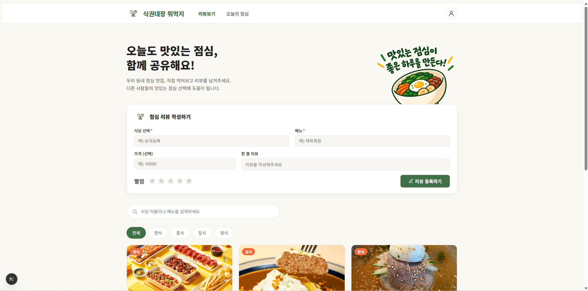
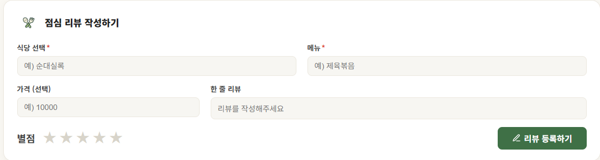
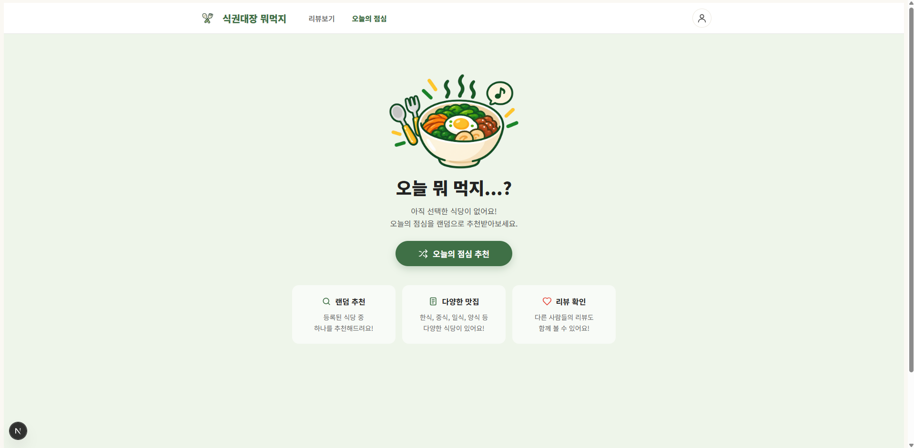
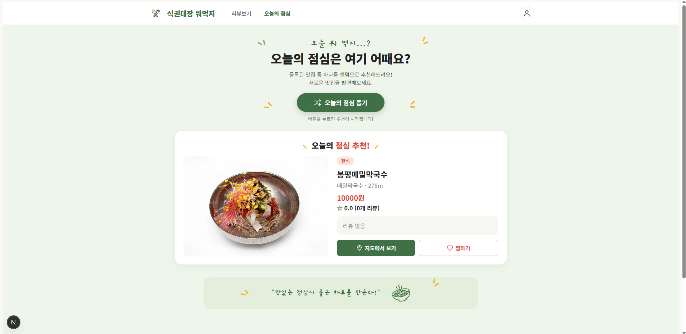

# 식권대장 뭐먹지

점심 식당을 검색하고, 리뷰를 남기고, 랜덤으로 오늘의 점심을 추천받을 수 있는 Next.js 기반 개인 프로젝트입니다.

- 개발 기간: 2026.09.30 ~ 2026.10.02
- 주요 사용자: 점심 메뉴 선택에 어려움을 겪는 직장인·수강생
- 제작 목적: 주변 식당의 정보와 다른 사람들의 리뷰를 한곳에서 확인하고, 고민될 때는 랜덤 추천으로 빠르게 메뉴를 정할 수 있도록 제작했습니다.
- 대상 과정: 새싹 동대문 4기

---

## 주요 기능

- 전체 식당 목록을 카드 형태로 조회하고, 더보기 버튼으로 이어서 볼 수 있습니다.
- 식당 이름으로 검색하고, 카테고리 버튼으로 원하는 종류의 식당만 골라 볼 수 있습니다.
- 식당을 검색해 선택한 뒤 메뉴, 가격, 한 줄 리뷰, 별점(1~5)을 입력해 리뷰를 등록할 수 있습니다. 로그인 없이 익명으로 작성합니다.
- 등록한 리뷰는 목록으로 바로 확인할 수 있고, 식당 카드에는 리뷰로 계산한 평균 평점이 표시됩니다. 리뷰가 없으면 "리뷰 없음"으로 표시됩니다.
- 식당 카드를 누르면 상세 화면으로 이동해 대표 메뉴, 가격, 거리, 평점을 확인할 수 있습니다.
- "오늘의 점심 추천" 버튼으로 등록된 식당 중 하나를 랜덤으로 추천받을 수 있습니다.

| 기능 | 주소 | 설명 |
|---|---|---|
| 식당 목록 / 리뷰 작성 | `/` | 식당 검색, 카테고리 필터, 식당 카드 목록, 리뷰 작성 폼을 제공합니다. |
| 오늘의 점심 / 상세 | `/review` | 랜덤 추천을 받을 수 있고, 선택한 식당이 없으면 안내 화면을 보여줍니다. |
| 식당 상세 | `/review?id=식당id` | 선택한 식당의 상세 정보를 보여줍니다. |

---

## 화면 구성

### 메인 화면



히어로 영역, 리뷰 작성 폼, 식당 검색창, 카테고리 버튼, 식당 카드 목록을 한 페이지에서 제공합니다.

### 리뷰 작성



식당을 검색해 고르고 메뉴, 가격, 한 줄 리뷰, 별점을 입력해 등록합니다. 필수 항목은 `*`로 표시했습니다.

### 상세 화면



랜덤 추천 또는 식당 카드 선택으로 들어오면 선택한 식당의 상세 정보를 확인할 수 있습니다.

### 랜덤 추천



"오늘의 점심 추천" 버튼을 누르면 등록된 식당 중 하나가 랜덤으로 선택되어 상세 정보와 함께 표시됩니다. 마음에 들지 않으면 "다른 곳 추천받기" 버튼으로 다시 뽑을 수 있습니다.

---

## 기술 스택

- Next.js (App Router)
- React
- JavaScript
- TanStack Query
- JSON Server
- CSS

---

## 설치 및 실행 방법

### 1. 저장소 복제

```bash
git clone 저장소주소
```

### 2. 프로젝트 폴더로 이동

```bash
cd front-project
```

### 3. 패키지 설치

```bash
npm install
```

### 4. JSON Server 실행

```bash
npm run server
```

### 5. Next.js 실행

새로운 터미널을 열어 실행합니다.

```bash
npm run dev
```

### 접속 주소

- Next.js: http://localhost:3000
- JSON Server: http://localhost:4000

JSON Server와 Next.js는 각각 실행되어야 하므로 서로 다른 터미널에서 실행합니다.

---

## 데이터 구조

`db.json`에 두 개의 리소스가 있습니다.

```
restaurants: id, name, category, distance, representativeMenu, price
reviews:     id, restaurantId, rating, content, menu, price
```

- 리뷰는 `restaurantId`로 식당과 연결됩니다.
- 로그인 기능이 없어서 리뷰에는 작성자 정보가 없습니다(익명).
- 식당의 평점과 리뷰 수는 DB에 저장하지 않고, 리뷰 목록에서 `filter`로 해당 식당의 리뷰를 고른 뒤 `reduce`로 평균을 계산해 화면에 표시합니다.

---

## 폴더 구조

```
front-project/
├─ app/
│  ├─ layout.js          # 공통 레이아웃 (Providers, Nav)
│  ├─ Nav.js             # 상단 네비게이션
│  ├─ page.js            # 메인 페이지 (목록, 검색, 카테고리)
│  ├─ ReviewForm.js      # 리뷰 작성 폼
│  ├─ RestaurantCard.js  # 식당 카드
│  ├─ globals.css        # 메인 페이지, Nav, 폼 스타일
│  └─ review/
│     ├─ page.js         # 오늘의 점심 / 상세 페이지
│     └─ review.css      # 상세 페이지 스타일
├─ public/images/        # 로고, 일러스트 이미지
├─ docs/                 # README용 화면 캡처
├─ db.json               # JSON Server 데이터
└─ README.md
```

---

## 주요 컴포넌트

| 컴포넌트 | 역할 |
|---|---|
| `Nav` | 로고와 탭(리뷰보기 / 오늘의 점심)을 보여주고, `usePathname`으로 현재 탭을 강조합니다. |
| `ReviewForm` | 식당 검색 드롭다운, 메뉴, 가격, 한 줄 리뷰, 별점을 입력받아 리뷰를 등록합니다. |
| `RestaurantCard` | 식당 한 곳의 정보와 평점을 표시하고, 클릭하면 상세 화면으로 이동합니다. |
| `Page` (`/`) | 식당 목록을 카테고리와 검색어로 걸러서 카드로 보여줍니다. |
| `Page` (`/review`) | 쿼리스트링의 `id`로 식당을 찾아 상세 정보를 보여주고, 랜덤 추천을 처리합니다. |

---

## 상태 관리

서버에서 가져오는 데이터와 화면에서만 쓰는 값을 나누어 관리했습니다.

- **서버 상태 (TanStack Query)**: `["restaurants"]`, `["reviews"]` 쿼리로 목록을 조회합니다. 리뷰를 등록한 뒤에는 `invalidateQueries(["reviews"])`로 목록을 다시 불러옵니다.
- **UI 상태 (useState)**: 카테고리, 검색어, 더보기 개수(`visibleCount`), 선택한 식당, 폼 입력값(별점, 메뉴, 가격, 한 줄 리뷰) 등은 해당 화면에서만 필요하므로 `useState`로 관리합니다.

---

## 트러블슈팅

### 작성한 CSS가 적용되지 않던 문제 (리뷰 폼의 버튼 스타일)

#### 문제

리뷰 등록 버튼(`.submit-button`)과 별점 버튼에 스타일을 작성했는데 화면에 반영되지 않았습니다.

#### 원인

폼 전체에 걸어 둔 `.review-form button[type="button"]` 선택자가 클래스 하나만 쓴 `.submit-button`보다 우선순위가 높았습니다. CSS는 더 구체적인 선택자의 스타일이 이기기 때문에, 나중에 쓴 스타일이 무시되었습니다.

#### 해결

우선순위가 밀리지 않도록 선택자를 더 구체적으로 작성했습니다.

```css
button[type="button"].submit-button { ... }
.review-form .star-rating .star { ... }
```

#### 알게 된 점

CSS는 작성 순서만이 아니라 선택자의 구체성에 따라 적용 결과가 달라진다는 것을 알게 되었습니다. 또 `main > div:first-of-type`처럼 구조에 의존한 선택자는 마크업이 바뀌면 깨지기 쉬워서, className 기반 선택자로 바꾸는 편이 안정적이라는 것도 배웠습니다.

---

## 프로젝트 회고

식당 검색, 카테고리 필터, 리뷰 등록, 랜덤 추천까지 한 서비스의 흐름을 직접 설계하고 구현해 볼 수 있었습니다. 서버에서 가져오는 데이터는 TanStack Query로, 화면에서만 쓰는 값은 `useState`로 나누어 관리하면서 두 상태의 차이를 실제로 경험했습니다.

식당의 평점을 DB에 저장하지 않고 리뷰 목록에서 계산하도록 한 점도 기억에 남습니다. 같은 데이터를 두 곳에 저장하지 않아도 된다는 장점이 있었지만, 데이터가 많아지면 매번 계산하는 비용이 생길 수 있다는 한계도 알게 되었습니다.

다음에는 로그인 기능을 붙여 리뷰에 작성자를 연결하고, 지도와 찜하기 기능을 추가하며, JSON Server 대신 실제 백엔드와 데이터베이스에 연결해 배포까지 해 보고 싶습니다.
